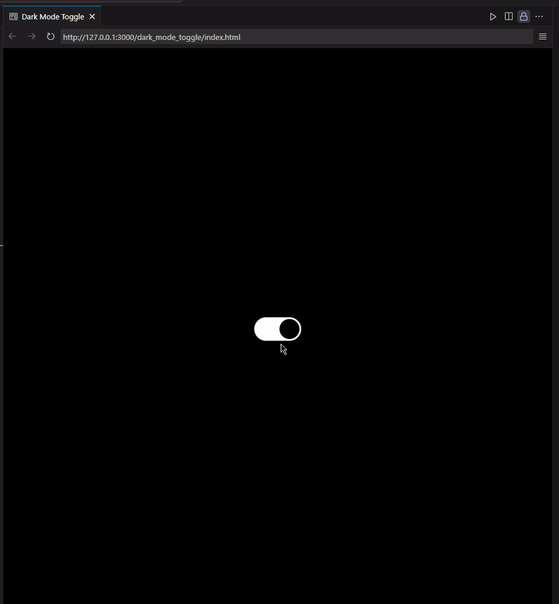

# Dark Mode Toggle

## Idea

1. Select the body element and the input checkbox.
2. Check if there is a saved mode in localStorage.
   - If yes, set the checkbox state to the saved mode.
   - If no, use the default mode (light mode).
3. Define a function to update the body background:
   - If the checkbox is checked, set the background to black (dark mode).
   - If the checkbox is unchecked, set the background to white (light mode).
4. Add an event listener to the checkbox:
   - Whenever the checkbox state changes, update the body background and save the new mode to localStorage.
5. Define a function to save the current mode to localStorage.

